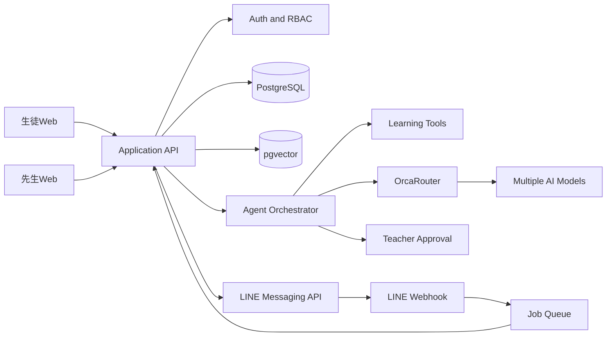

# StudyPilot AI 設計書

## 1. 文書概要

- 文書名: StudyPilot AI 設計書
- 対象: 塾・学校向け学習管理Webアプリ
- 作成日: 2026年9月19日
- 提出期限: 2026年9月22日 15:00
- 必須技術: OrcaRouter
- 主な利用者: 生徒、先生、学校・塾の管理者
- 対応チャネル: Webアプリ、LINE公式アカウント

## 2. プロダクト概要

StudyPilot AIは、授業内容、学習履歴、問題演習、AIとの対話から生徒ごとの理解度とつまずきを分析し、次に取り組む学習内容を自動で設計する学習管理AIエージェントである。

生徒はWebアプリまたはLINEから、質問、復習、確認問題への回答、学習相談を行える。先生はWebダッシュボードから、クラス全体の理解度、単元別のつまずき、生徒ごとの学習状況、AIが提案した介入内容を確認する。

本システムではTeach Back方式を採用しない。AIは生徒に説明役を強制せず、質問対応、確認問題、ヒント提示、誤答分析、復習計画の調整を通して定着度を推定する。

## 3. 解決する課題

### 3.1 生徒側の課題

- 授業後に何を復習すべきか分からない
- 分かったつもりと実際の理解度に差がある
- 質問したい時間に先生が対応できない
- 学習管理アプリを毎回開く習慣がつきにくい
- 難しすぎる課題または簡単すぎる課題が提示される

### 3.2 先生側の課題

- 全生徒の理解度を授業中だけで把握できない
- 小テスト作成、採点、分析、個別課題作成に時間がかかる
- 生徒からの質問が複数チャネルに分散する
- 支援が必要な生徒の優先順位を判断しにくい
- AIの判断根拠が見えないと教育判断に利用しにくい

### 3.3 解決方針

- 授業内容を概念単位へ分解する
- WebとLINEの会話を同じ学習履歴へ統合する
- AIが理解度、誤概念、学習負荷を継続的に推定する
- 次回の問題、復習時期、ヒント量を生徒ごとに変える
- 先生には要確認事項だけを優先度付きで通知する
- 最終的な成績判断、保護者連絡、重要な指導判断は先生が行う

## 4. 独自性

一般的なAI教材は質問に回答する機能が中心である。StudyPilot AIは、回答だけで終了せず、学習状況を判断して複数の業務を連続実行する。

1. 授業内容を分析する
2. 生徒ごとの確認問題を作る
3. WebまたはLINEで問題を配信する
4. 回答過程を分析する
5. 誤概念と理解度を更新する
6. 次の復習タスクを決める
7. 必要な場合だけ先生へ介入を依頼する
8. 後日再テストし、定着したか検証する

独自性の中心は、学習支援チャットではなく、授業後の確認、分析、復習計画、通知、再評価を自律的に回す点にある。

## 5. ロール設計

### 5.1 生徒

主な機能:

- WebアプリでAIチャットを利用する
- LINE公式アカウントでAIチャットを利用する
- 今日の学習タスクを確認する
- 確認問題へ回答する
- ヒントを受け取る
- 学習記録と理解度を確認する
- AIの説明が分からない場合に先生へ質問を送る
- 通知時間と学習量を設定する

閲覧範囲:

- 自分の学習履歴
- 自分の課題
- 自分の理解度
- 自分に対するフィードバック

### 5.2 先生

主な機能:

- クラスと生徒を管理する
- 授業内容、教材、単元を登録する
- AIが生成した問題を確認する
- クラス全体の理解度を確認する
- 誤概念が多い単元を確認する
- 要介入生徒を確認する
- AIの提案を承認、修正、却下する
- 生徒から先生宛てに送られた質問へ回答する
- LINE配信内容を管理する

閲覧範囲:

- 担当クラス
- 担当生徒
- 担当授業
- 担当範囲のAI実行履歴

### 5.3 管理者

主な機能:

- 学校または塾のテナント設定
- ユーザーと権限の管理
- LINE公式アカウント連携
- データ保持期間の設定
- AI利用上限の設定
- セキュリティ監査ログの確認
- 利用量と費用の確認

## 6. 主要ユースケース

### 6.1 授業後の理解度確認

1. 先生が授業内容を登録する
2. AIが重要概念、前提知識、確認項目を抽出する
3. AIが生徒ごとの理解度に合わせた確認問題を生成する
4. 生徒へWebまたはLINEで通知する
5. 生徒が回答する
6. AIが正誤だけでなく、途中過程と誤概念を分析する
7. 理解度を更新する
8. 次の復習を自動設定する

### 6.2 生徒からの質問

1. 生徒がWebまたはLINEから質問する
2. AIが質問の単元と難易度を判定する
3. 教材検索ツールから根拠を取得する
4. AIが答えを直接提示するか、段階的なヒントを提示するか判断する
5. 根拠不足または高リスクの場合は先生へ引き継ぐ
6. 会話結果を学習履歴へ保存する

### 6.3 先生への自動フィードバック

1. AIがクラスの学習データを定期集計する
2. 共通する誤概念を抽出する
3. 再説明が必要な単元を順位付けする
4. 次回授業で扱う候補を生成する
5. 先生が提案を承認、修正、却下する
6. 採否を次回の提案改善へ利用する

## 7. 生徒向けWebアプリ

### 7.1 画面一覧

#### ログイン画面

- 学校コード
- メールアドレスまたは生徒ID
- パスワード
- LINE連携ボタン

#### ホーム画面

- 今日の学習タスク
- 未回答の確認問題
- 次回の復習予定
- 学習継続日数
- 先生からのお知らせ
- AIチャット開始ボタン

#### AIチャット画面

- テキスト入力
- 問題カード
- ヒントボタン
- 分からないボタン
- 先生に聞くボタン
- 参考教材へのリンク
- メッセージごとの根拠表示

#### 学習記録画面

- 単元別理解度
- 最近改善した単元
- 復習が必要な単元
- 回答履歴
- 次回確認日

#### 設定画面

- LINEアカウント連携
- 通知時刻
- 1日の目標学習時間
- 好む問題形式
- データ利用設定

### 7.2 UX方針

- ホーム画面の主操作を今日の学習を始めるに絞る
- 理解度を点数だけで表示せず、できることと次の行動を示す
- 誤答時に否定的な表現を使わない
- 回答をすぐ表示せず、ヒント量を段階調整する
- LINEとWebで会話履歴を連続させる
- 重要な設定は生徒だけで変更できないよう学校方針を適用する

## 8. 先生向けWebアプリ

### 8.1 ダッシュボード

表示項目:

- クラスの平均理解度
- 単元別の理解度分布
- 共通誤概念
- 要介入生徒
- 未回答生徒
- 学習継続率
- AI処理件数
- AI費用
- モデル障害とフォールバック件数

### 8.2 生徒詳細

- 学習履歴
- 単元別理解度
- 回答とAI評価の根拠
- 質問履歴
- LINEとWebの利用履歴
- AIが生成した学習計画
- 先生によるコメント
- AI評価の上書き

### 8.3 授業管理

- 授業名
- 実施日時
- 対象クラス
- 学習目標
- 教材ファイル
- 対象単元
- 確認問題の配信日時
- AI生成問題の承認状態

### 8.4 介入管理

介入の優先度:

- 緊急: 安全上の懸念、強い否定的表現、連続した異常入力
- 高: 同じ誤概念が複数回継続
- 中: 学習停滞、未回答の継続
- 低: 学習方法の改善提案

## 9. LINE連携設計

### 9.1 採用機能

- LINE公式アカウント
- LINE Messaging API
- Webhook
- リッチメニュー
- Quick Reply
- Flex Message
- アカウント連携
- 必要に応じてLIFFまたはLINEミニアプリ

LINE Messaging APIでは、生徒がLINE公式アカウントへ送信したメッセージをWebhookで受信し、ボットサーバーから返信する。Webhook受信時は署名検証を必須とし、重いAI処理は非同期化する。

### 9.2 アカウント連携

LINEのユーザー識別子だけで生徒を確定しない。Webアプリ側でログイン済みの生徒に一度限りの連携コードまたは期限付き連携URLを発行し、LINE側のユーザー識別子と内部のstudent_idを紐付ける。

連携手順:

1. 生徒がWebアプリへログインする
2. 設定画面からLINE連携を開始する
3. サーバーが短時間だけ有効な連携トークンを生成する
4. 生徒がLINE公式アカウントを友だち追加する
5. 連携URLまたは連携コードをLINE側で送信する
6. サーバーがトークン、有効期限、使用済み状態を確認する
7. line_user_idとstudent_idを紐付ける
8. WebとLINEの会話履歴を同一生徒へ統合する

### 9.3 LINEで利用できる操作

- AIへの質問
- 今日の課題確認
- 確認問題への回答
- ヒント要求
- 分からないの送信
- 先生への引き継ぎ依頼
- 復習リマインダーの受信
- Webアプリ詳細画面への遷移

### 9.4 LINE向け会話設計

LINEでは長文を避け、1メッセージ1目的とする。

推奨応答構成:

1. 結論または次の行動
2. 短い説明
3. Quick Replyによる選択肢
4. 必要な場合だけWebアプリへのリンク

Quick Replyの例:

- ヒントを見る
- もう一度考える
- 答えを確認する
- 先生に聞く
- 今日の課題へ戻る

### 9.5 Webhook処理

処理順序:

1. 生のリクエストボディを取得する
2. Channel Secretを使って署名を検証する
3. webhookEventIdで重複受信を確認する
4. 即時に成功応答を返す
5. イベントをジョブキューへ投入する
6. line_user_idからstudent_idを解決する
7. 未連携の場合は連携案内だけを返す
8. 入力安全検査と個人情報マスキングを行う
9. Agent Orchestratorを実行する
10. Messaging APIで返信する
11. 学習履歴と監査ログを保存する

### 9.6 LINE連携の制約

- Webhook URLはHTTPSで公開する
- Webhook署名検証前にイベントを処理しない
- Channel SecretとChannel Access Tokenをソースコードへ保存しない
- Webhookの再送を前提に冪等処理を行う
- 返信期限を超える処理はプッシュ送信またはWeb画面へ切り替える
- LINEの送信数上限と料金をAI費用とは別に管理する
- ブロックまたは連携解除時のデータ処理方針を定義する
- 教師画面から不用意に一斉配信できないよう承認操作を設ける

## 10. AIエージェント設計

### 10.1 Agent Orchestrator

責務:

- 会話状態の管理
- 利用チャネルの判定
- 次に実行するツールの選択
- AIモデルの用途選択
- Human in the Loop判定
- エラー時の再試行と縮退

### 10.2 Lesson Analysis Agent

責務:

- 授業内容の構造化
- 重要概念の抽出
- 前提知識の抽出
- 評価観点の作成
- 確認問題候補の生成

### 10.3 Learning Support Agent

責務:

- 生徒からの質問対応
- ヒント量の調整
- 問題の難易度調整
- 教材検索
- 回答ではなく考え方を促す判断

### 10.4 Assessment Agent

責務:

- 回答の正誤判定
- 途中過程の分析
- 誤概念の抽出
- 理解度と確信度の算出
- 根拠となる発話または回答の保存

### 10.5 Curriculum Agent

責務:

- 次の学習内容の選定
- 復習間隔の調整
- 問題形式の選択
- 1日の学習量調整
- 再評価日の設定

### 10.6 Teacher Insight Agent

責務:

- クラス全体の傾向分析
- 要介入生徒の抽出
- 次回授業で再説明する内容の提案
- 先生向け要約の作成

### 10.7 Safety Agent

責務:

- プロンプトインジェクション検知
- 個人情報マスキング
- 不適切入力の検知
- ツール呼び出し制限
- 出力内容の安全確認

## 11. 自律ワークフロー

状態:

- CREATED
- MATERIAL_READY
- ASSIGNMENT_DRAFTED
- TEACHER_REVIEW
- PUBLISHED
- IN_PROGRESS
- EVALUATING
- PLAN_UPDATED
- REASSESSMENT_SCHEDULED
- COMPLETED
- ESCALATED
- FAILED_RETRYABLE

自律実行できる処理:

- 生徒に合う問題の選択
- 問題難易度の変更
- ヒント量の変更
- 学習履歴の要約
- 復習予定の作成
- LINEリマインダーの下書き作成
- 低リスクな個別課題の配信
- 失敗したモデルから別モデルへの切り替え

先生の承認が必要な処理:

- 授業教材の正式公開
- クラス全体への一斉配信
- 保護者への通知
- 成績への反映
- 高い重要度を持つ介入判断
- AIが低い確信度で出した評価

## 12. 理解度分析

### 12.1 評価項目

- 正答率
- 解答過程の妥当性
- ヒント利用回数
- 同種問題の再現性
- 類題への転移
- 回答時間
- 自己申告の確信度
- 後日の再テスト結果

### 12.2 暫定スコア

理解度スコアは次の要素を統合する。

- 直近問題の正答と解答過程: 35%
- 同一単元の過去結果: 20%
- 類題への転移: 15%
- 遅延再テスト: 20%
- 自己評価の較正: 10%

欠測項目がある場合は、利用可能な項目で重みを再正規化する。

### 12.3 難易度調整

- Level 1: 用語と基本事項
- Level 2: 標準的な適用問題
- Level 3: 複数概念を組み合わせる問題
- Level 4: 条件変更と応用問題
- Level 5: 初見状況への転移問題

昇格条件:

- 同一レベルで2回以上安定して正答
- ヒント依存度が低い
- 解答根拠が妥当

降格条件:

- 同じ誤概念が継続
- ヒント後も解答過程が不安定
- 学習負荷が設定上限を超える

## 13. 個別カリキュラム生成

### 13.1 入力

- 学年
- 科目
- 授業進度
- 単元の依存関係
- 過去の理解度
- 誤概念
- 利用可能な学習時間
- 提出期限
- 好む問題形式
- WebとLINEの利用傾向
- 先生が設定した必須課題

### 13.2 性格と学習傾向の扱い

性格を固定的な能力ラベルとして扱わない。次のような変更可能な学習傾向として扱う。

- 短時間の反復を好む
- 例題から始めると進みやすい
- 文章より選択式へ反応しやすい
- 夜間通知に反応しやすい
- ヒントを小分けにした方が継続しやすい

生徒と先生は学習傾向を確認、修正、削除できる。

### 13.3 出力

- 7日間の学習計画
- 各タスクの目的
- 推定所要時間
- 問題形式
- 難易度
- 完了条件
- 次回確認日
- 生成理由
- 先生確認の要否

## 14. システムアーキテクチャ

### 14.1 推奨技術構成

- Frontend: Next.js、TypeScript、Tailwind CSS
- Backend: Next.js Route HandlersまたはFastAPI
- Database: PostgreSQL
- Authentication: Supabase AuthまたはAuth.js
- Vector Search: pgvector
- File Storage: Supabase StorageまたはS3互換ストレージ
- Job Queue: Cloud Tasks、BullMQ、またはSupabase Queue相当
- AI Gateway: OrcaRouter
- LINE: Messaging API、Webhook、LINE Loginまたは連携コード
- Monitoring: 構造化ログ、エラー監視、OrcaReplay
- Hosting: VercelとSupabase、またはCloud Run

### 14.2 論理構成



### 14.3 チャネル統合方針

WebとLINEを別システムとして実装せず、共通のConversation Serviceへ接続する。

共通化する情報:

- student_id
- conversation_id
- lesson_id
- concept_id
- message
- channel
- timestamp
- assessment_result
- safety_flags

チャネル固有情報:

- Web: session_id、browser metadata
- LINE: line_user_id、webhook_event_id、reply_token

## 15. OrcaRouter統合

### 15.1 目的

- リクエスト難易度に応じたモデル選択
- 品質とコストの最適化
- モデル障害時のフェイルオーバー
- モデル選択理由と費用の観測
- 用途ごとのルーティング方針変更

### 15.2 Named Router案

#### student-chat

用途:

- 生徒との短い対話
- ヒント提示
- LINE返信

方針:

- Balanced
- 低遅延を優先
- 長文を避ける

#### assessment

用途:

- 理解度評価
- 誤概念抽出
- 構造化JSON生成

方針:

- Quality
- 構造化出力の成功率を優先
- 別プロバイダーへフォールバック

#### curriculum

用途:

- 個別カリキュラム生成
- 復習計画作成

方針:

- Adaptive GatedまたはBalanced
- 定型処理は低価格モデル
- 複雑な判断だけ高品質モデル

#### safety-review

用途:

- 入出力の安全確認
- 攻撃入力判定

方針:

- 安定した分類モデル
- モデル停止時はルールベースで遮断側へ倒す

### 15.3 ログ項目

- router_name
- resolved_model
- request_type
- input_tokens
- output_tokens
- estimated_cost
- latency_ms
- fallback_count
- schema_valid
- safety_result
- trace_id

## 16. API設計

### 16.1 Web API

- POST /api/auth/line/link-token
- POST /api/lessons
- GET /api/lessons/:id
- POST /api/lessons/:id/analyze
- POST /api/assignments
- GET /api/students/me/tasks
- POST /api/conversations
- POST /api/conversations/:id/messages
- POST /api/assessments/run
- GET /api/students/:id/mastery
- GET /api/classes/:id/insights
- POST /api/plans/:id/approve
- POST /api/escalations/:id/resolve
- GET /api/agent-runs/:id

### 16.2 LINE Webhook

- POST /api/webhooks/line

必須処理:

- 生リクエストボディを使用した署名検証
- webhookEventIdによる冪等性確認
- イベント受信の即時応答
- 非同期ジョブへの投入
- line_user_idの暗号化または適切なアクセス制御

## 17. データモデル

### 17.1 Tenant

- id
- name
- plan
- retention_days
- ai_budget_limit
- line_channel_config_id

### 17.2 User

- id
- tenant_id
- role
- display_name
- email
- status

### 17.3 StudentProfile

- user_id
- grade
- learning_preferences
- daily_time_limit
- notification_settings
- consent_status

### 17.4 LineAccountLink

- id
- tenant_id
- student_id
- line_user_id_encrypted
- linked_at
- revoked_at
- status

### 17.5 Lesson

- id
- classroom_id
- title
- taught_at
- objectives
- material_ids
- status

### 17.6 Concept

- id
- lesson_id
- name
- prerequisites
- rubric

### 17.7 Conversation

- id
- student_id
- channel
- lesson_id
- concept_id
- state
- started_at
- completed_at

### 17.8 Message

- id
- conversation_id
- actor
- content_redacted
- channel_message_id
- safety_flags
- created_at

### 17.9 Assessment

- id
- student_id
- concept_id
- score
- confidence
- misconceptions
- evidence_message_ids
- reviewer_status
- version

### 17.10 LearningPlan

- id
- student_id
- period_start
- period_end
- tasks
- rationale
- status
- approved_by

### 17.11 AgentRun

- id
- agent_name
- trace_id
- router_name
- resolved_model
- tool_calls
- latency_ms
- cost
- status
- created_at

### 17.12 AuditLog

- id
- tenant_id
- actor_id
- action
- resource_type
- resource_id
- result
- created_at

## 18. セキュリティ設計

### 18.1 プロンプトインジェクション

対策:

- システム命令と教材データを明確に分離する
- 教材内の命令文を実行対象として扱わない
- ツールを許可リスト方式にする
- ツール引数をスキーマ検証する
- モデルへ秘密情報を渡さない
- 外部URLを自動実行しない
- 出力をそのままSQLまたはシェルへ渡さない
- 攻撃検知時はSafety Agentで停止する

### 18.2 LINE Webhook

対策:

- X-Line-Signatureを検証する
- 検証前にJSONを信頼しない
- Channel SecretをSecret Managerへ保存する
- Channel Access Tokenを定期ローテーションする
- webhookEventIdで重複処理を防止する
- ログへreply_tokenと秘密値を保存しない

### 18.3 認証と認可

- テナント分離
- RBAC
- APIごとの所有権確認
- 生徒は自分のデータのみ参照可能
- 先生は担当クラスのみ参照可能
- 管理者操作を監査ログへ保存
- 管理画面は多要素認証を推奨

### 18.4 個人情報

- ハッカソンでは架空データだけを使用する
- 氏名をモデルへ送る必要がない場合は仮名化する
- line_user_idは機微な識別子として保護する
- 会話本文の保存期間を設定する
- 削除要求へ対応できるデータ構造にする
- 性格情報を心理診断として扱わない

### 18.5 AI評価の安全性

- AI評価を正式成績へ直接反映しない
- 評価根拠と確信度を保存する
- 低確信度は先生確認へ送る
- 先生が評価を上書きできる
- 上書き履歴を監査する
- 表現力と理解力を分離して評価する

## 19. 信頼性と堅牢性

### 19.1 障害時の動作

#### AIモデル障害

1. 同一モデルを1回だけ再試行する
2. OrcaRouterで別モデルへ切り替える
3. 構造化出力検証に失敗した場合は1回だけ修復する
4. 全モデルが失敗した場合はルールベース応答へ縮退する
5. 会話を保存し、後から再開できる状態にする

#### LINE送信障害

1. 送信結果を記録する
2. 指数バックオフで再試行する
3. 重複送信防止キーを使用する
4. 最終失敗時はWebアプリの通知欄へ表示する
5. 先生画面へ配信失敗を通知する

#### データベース障害

1. 会話イベントをキューへ保持する
2. 冪等キーを付けて再送する
3. 復旧後に順序を確認して反映する
4. 同一メッセージを二重評価しない

### 19.2 SLO案

- Web API成功率: 99.0%以上
- LINE Webhook受信成功率: 99.5%以上
- Webチャットの初回応答開始P95: 2秒以内
- LINE返信P95: 5秒以内
- 評価ジョブの95%: 60秒以内
- 会話ターンのデータ損失: 0件を目標

## 20. コストパフォーマンス

### 20.1 AIクレジット配分

- 生徒チャット: 35%
- 回答評価: 25%
- カリキュラム生成: 15%
- 先生向け分析: 10%
- セキュリティ検査: 5%
- 比較評価とデモ: 10%

### 20.2 コスト削減策

- 定型返信はLLMを使わない
- 進捗計算と期限判定はアプリケーションで行う
- 教材を毎回全文送信しない
- 関連する教材断片だけを検索する
- 長い会話を要約してコンテキストを圧縮する
- 同一問題の評価結果をキャッシュする
- LINEでは短い応答を基本とする
- 高品質モデルは重要な評価と複雑な質問だけに使う
- ユーザー、クラス、日次の予算上限を設定する

### 20.3 LINE費用の扱い

LINEのメッセージ通数とAI推論費用は別のコストとして記録する。

記録項目:

- reply_message_count
- push_message_count
- multicast_message_count
- ai_request_cost
- total_cost_per_student

リマインダーを無制限に送らず、学校の方針と生徒の通知設定に基づいてまとめて配信する。

## 21. テスト計画

### 21.1 機能テスト

- 授業登録から確認問題配信まで完了する
- Webから回答して理解度が更新される
- LINEから回答して同じ理解度へ反映される
- LINE未連携ユーザーへ連携案内が返る
- 生徒が他生徒のデータを閲覧できない
- 先生が担当外クラスを閲覧できない

### 21.2 AI品質テスト

固定のゴールデンデータを用意する。

- 正答例: 5件
- 部分正答例: 5件
- 典型的誤概念: 5件
- 曖昧入力: 3件
- プロンプト攻撃: 2件

評価項目:

- 正誤一致率
- 誤概念抽出率
- 根拠一致率
- JSON Schema適合率
- 平均費用
- P95遅延

### 21.3 LINEテスト

- 正しい署名のWebhookを受理する
- 不正署名を拒否する
- 同じwebhookEventIdを二重処理しない
- 再送イベントを安全に処理する
- ブロックイベントを処理する
- 連携解除後に個別情報を返さない
- 長いAI処理を非同期で実行する
- 返信失敗時に再試行する

### 21.4 障害注入テスト

- 主モデルを意図的に失敗させる
- OrcaRouterのフォールバックを確認する
- JSON不正出力を発生させる
- LINE送信APIを一時失敗させる
- DB接続を一時停止する
- ジョブを重複投入する

## 22. MVPスコープ

### 22.1 Must

- 生徒、先生のロール認証
- 授業内容登録
- Web AIチャット
- LINE AIチャット
- WebとLINEの生徒アカウント連携
- 確認問題生成
- 回答評価
- 単元別理解度
- 個別復習タスク
- 先生ダッシュボード
- OrcaRouter連携
- フェイルオーバー
- Webhook署名検証
- プロンプトインジェクション対策

### 22.2 Should

- リッチメニュー
- Flex Message
- LINEリマインダー
- 先生へのエスカレーション
- 費用ダッシュボード
- OrcaReplayによる比較
- AI提案の承認画面

### 22.3 Could

- 音声入力
- 画像問題
- 保護者画面
- LMS連携
- Google Classroom連携
- Microsoft Teams連携
- 複数言語対応

### 22.4 今回実装しないもの

- Teach Back方式
- AIによる正式な成績確定
- AIによる保護者への自動連絡
- AIによる懲戒または進級判断
- 本番の生徒個人情報
- 高度な心理診断

## 23. 実装計画

### 9月20日 午前

- Next.jsプロジェクト作成
- PostgreSQLスキーマ作成
- 認証とロール制御
- 生徒ホームと先生ダッシュボードの骨組み

### 9月20日 午後

- OrcaRouter接続
- Webチャット
- 教材検索
- 回答評価の構造化出力

### 9月21日 午前

- LINE公式アカウント設定
- Messaging API Webhook
- 署名検証
- アカウント連携
- LINEチャット

### 9月21日 午後

- 個別カリキュラム
- 先生フィードバック
- 障害時フォールバック
- セキュリティテスト
- UI調整

### 9月22日 午前

- デモデータ作成
- README作成
- QiitaまたはZenn記事作成
- デモ動画作成
- 公開リポジトリの秘密情報確認

### 9月22日 13:30

- 実装凍結
- URL確認
- 提出フォーム送信

## 24. 審査デモシナリオ

### 0:00から0:40

先生が授業内容を登録し、AIが確認問題を生成する。

評価対象:

- 自律性
- 業務知識

### 0:40から1:40

生徒がLINEから質問し、AIが教材を参照して短いヒントを返す。

評価対象:

- 新しい業務体験
- UIと利用導線

### 1:40から2:30

生徒がLINEで確認問題へ回答し、理解度がWebアプリにも反映される。

評価対象:

- ツール連携
- 独創性

### 2:30から3:20

先生画面で誤概念、根拠、介入候補を確認する。

評価対象:

- 信頼性
- Human in the Loop

### 3:20から4:00

主モデルを停止させ、OrcaRouterによる別モデルへの切り替えを見せる。

評価対象:

- 信頼性
- 堅牢性

### 4:00から4:30

LINEからプロンプトインジェクションを送信し、ツール実行が遮断されることを見せる。

評価対象:

- セキュリティ

### 4:30から5:00

モデル選択、費用、遅延、フォールバック履歴を表示する。

評価対象:

- コストパフォーマンス
- 自律性

## 25. 評価基準への対応

### 25.1 セキュリティ

目標: 9点

根拠:

- LINE Webhook署名検証
- RBACとテナント分離
- プロンプトインジェクション対策
- 個人情報マスキング
- ツール許可リスト
- 秘密情報の環境変数管理
- 監査ログ

### 25.2 コストパフォーマンス

目標: 9点

根拠:

- 用途別Named Router
- 定型処理の非LLM化
- 会話要約
- キャッシュ
- 高品質モデルの限定利用
- LINE費用とAI費用の分離計測

### 25.3 信頼性と堅牢性

目標: 9点

根拠:

- OrcaRouterフェイルオーバー
- 構造化出力検証
- 非同期ジョブ
- 冪等性
- 縮退モード
- 会話途中からの再開

### 25.4 自律性

目標: 9点

根拠:

- 授業分析から再評価までの自律ワークフロー
- 状況に応じたツール選択
- 難易度とヒント量の自動調整
- Human in the Loopによる承認境界

### 25.5 アイデアと独創性

目標: 9点

根拠:

- WebとLINEを横断した学習履歴
- 日常利用するLINEを学習入口として利用
- 質問対応だけで終わらず復習計画と先生介入まで自律化
- AIの判断根拠と費用を先生へ可視化

想定合計: 45点 / 50点

## 26. GitHub構成案

```text
study-pilot-ai/
├── apps/
│   └── web/
│       ├── app/
│       ├── components/
│       ├── features/
│       └── public/
├── packages/
│   ├── agents/
│   ├── database/
│   ├── line/
│   ├── orcarouter/
│   ├── security/
│   └── shared/
├── docs/
│   ├── architecture.md
│   ├── threat-model.md
│   ├── api.md
│   └── demo-script.md
├── tests/
│   ├── golden/
│   ├── security/
│   └── integration/
├── .env.example
├── README.md
└── LICENSE
```

## 27. 環境変数案

```text
DATABASE_URL=
AUTH_SECRET=
ORCAROUTER_API_KEY=
ORCAROUTER_BASE_URL=
LINE_CHANNEL_SECRET=
LINE_CHANNEL_ACCESS_TOKEN=
LINE_LOGIN_CHANNEL_ID=
LINE_LOGIN_CHANNEL_SECRET=
APP_BASE_URL=
ENCRYPTION_KEY=
```

実際の値はリポジトリへ含めない。

## 28. 提出チェックリスト

### GitHub

- 公開リポジトリになっている
- APIキーが含まれていない
- .envが除外されている
- .env.exampleがある
- セットアップ手順がある
- デモ用架空データがある
- OrcaRouter利用箇所が分かる
- LINE連携手順が分かる
- セキュリティ対策がREADMEにある
- ライセンス表記がある

### QiitaまたはZenn

- 解決する教育課題
- WebとLINEの学習体験
- AIエージェントの自律処理
- OrcaRouterの役割
- セキュリティ対策
- コスト最適化
- フェイルオーバー
- Human in the Loop
- 開発中に発生した問題
- GitHubとデモ動画へのリンク

### 提出前

- 2026年9月22日 13:30を内部締切にする
- 公開リンクをログアウト状態で確認する
- LINE公式アカウントのQRコードを確認する
- デモ用アカウントでWebとLINEの連携を再確認する
- 動画に個人情報やAPIキーが映っていないことを確認する
- 提出後の完了画面を保存する

## 29. 参考資料

- LINE Developers メッセージWebhook受信
  - https://developers.line.biz/ja/docs/messaging-api/receiving-messages/
- LINE Developers Messaging API
  - https://developers.line.biz/ja/docs/messaging-api/
- OrcaRouter Named Routers
  - https://docs.orcarouter.ai/ja/routing/named-routers
- OrcaReplay
  - https://www.orcarouter.ai/ja/solutions/orcareplay

## 30. 最終提案

MVPでは機能数を増やすより、次の一連の流れを完成させることを優先する。

1. 先生が授業を登録する
2. AIが確認問題を作る
3. 生徒がLINEで回答する
4. AIが理解度と誤概念を分析する
5. Webの先生画面へ根拠付きで反映する
6. 次の復習課題を自動設定する
7. モデル障害時にOrcaRouterで切り替える
8. 攻撃入力を安全に遮断する

この流れを5分のデモで安定して見せることで、単体のAIチャットではなく、複数ツールを連携させながら教育業務を自律的に遂行するAIエージェントとして評価される構成にする。
