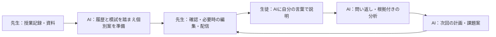

# トイノワ：実装・実測と判断の根拠

2026-09-22更新。記事・展示・発表で使う共通の根拠集。基準コードは `8596a8d` と、その後のローカル修正（自己紹介・取り消し・見出し）を含む。公開版と同一とは限らない。実装・試験・モデル実測を分け、チーム内の担当によらず、確認できる証拠をまとめる。

## サービスが任せる仕事

**先生が授業記録を渡すと、AIが生徒別の復習課題を準備する。生徒がAIに説明した内容を、次の指導と学習計画へつなぐ。**

対象は塾・個別指導の先生と生徒。先生は授業で教えること、課題の配信判断、必要な生徒への介入を担当する。生徒が自分の言葉で説明し、AIは課題設計・問い返し・根拠付き分析・次回案の準備を担当する。ファインマンテクニックに着想を得ているが、成績向上を実証したという意味ではない。

クラス単位・生徒の直接指定に対応する。次のお題を無限に自動配信しない。承認前の課題、計画詳細、先生用の詳細評価を生徒へそのまま公開しない。

## 5つの評価項目に対する説明

ユーザー提供のガイダンスに基づく。テーマは「業務を自律化するAIエージェント」。機械採点を行うとの情報は確認していない。

| 評価項目 | 伝える主張 | 主な根拠 | 説明を限定する点 |
| --- | --- | --- | --- |
| セキュリティ | 教材・会話を命令から区別し、入出力検査、所属・担当の権限、承認を組み合わせる | [E4](#e4-セキュリティ)、RLSの実DB試験 | 未知の攻撃や実画像経由の防御率は未確定 |
| コストパフォーマンス | モデルの品質・費用・時間を比較し、共有・再利用・用途別選択で不要な呼び出しを減らす | [E1](#e1-模試のモデル選択)、[E2](#e2-処理の費用対策) | サービス全体の削減率やキャッシュによる削減額は未測定 |
| 信頼性・堅牢性 | 検査できない結果は保留し、保存済みの進捗から復旧する。失敗を成功に見せない | [E3](#e3-復旧と人の確認)、[E6](#e6-現在の自動テスト) | 別モデルで必ず継続する保証はない。模試専用経路は切り替えない |
| 自律性 | 授業後の準備・問い返し・分析・次回案を進め、配信と重要な修正判断を先生に戻す | [E5](#e5-自律性と人の判断) | 処理の流れは定義済み。任意の外部ツールを自由に選ぶエージェントではない |
| アイデア・独創性 | 生徒の「説明」を、模試や授業と結び付けて次の宿題判断へ戻す | 役割別の一連のデモ、前計画・根拠評価への参照 | 対話型学習そのものの世界初・教育効果の実証は主張しない |

## E1 模試のモデル選択

### 何を測ったか

実物の模試2回分・紙3ページを、スキャンと2条件の写真にして9入力とした。本人承認済みの正解表で、必要な数値450項目／モデルを採点。意味の違う列に対応した数値も誤りとする。画像全体のOCR精度ではない。

| 初回比較 | 必要項目の一致 | 観測した問題 |
| --- | ---: | --- |
| Gemini 2.5 Flash | 399/450（88.7%） | JSON打ち切り、平均点と割合の混同 |
| Gemini 2.5 Flash-Lite | 325/450（72.2%） | 必要項目の欠落、列の意味の混同 |
| GPT-4o mini | 31/450（6.9%） | 必要項目の欠落358件。モデル一般のOCR能力の評価ではない |

抽出と提案の分離、表・列見出しの抽出、コードによる検算・重複統合を進めた。その後、問題のあったA/BのスキャンをFlashとProで各1回比較した。OrcaReplayで画像・要求・スキーマを揃え、モデルだけ変更した。

| 少数追加比較 | Flash | Pro |
| --- | --- | --- |
| A | 57/57一致・28.56秒・$0.016112 | 57/57一致・54.80秒・$0.110792 |
| B | 30/30一致・15.98秒・$0.009134 | 60.02秒でタイムアウト・費用不明 |

同じAの一致結果に対しProは約6.9倍の費用・約1.9倍の時間だった。この条件では品質上の利点を確認できず、模試専用経路はFlashを維持した。

補足CではFlashが63/63一致したが、表の親見出しを確認できず、自動反映を保留した。3スキャンで150/150一致しても、自動反映可能と判定した入力は2/3。**数値の一致と、無確認で使えることを分けて扱った。**

見出しの検証ルールは同じ回答を見てオフラインで調整している。未知の帳票への汎化評価ではなく、初回9入力の結果を3スキャンの数字で置き換えない。

### 再利用できる記録

- 公開可能な集計JSON：[exam-benchmark-summary.json](data/exam-benchmark-summary.json)。モデル・分母・時間・費用・確認待ちを別項目にした。
- 詳細：[初回比較](exam-model-benchmark.md)、[v2](exam-model-benchmark-improvement.md)、[現在の採用判断](exam-reading-reliability.md)。
- 元の資料・要求・回答・正解表はGit対象外。共有JSONには画像・生徒の文章・アカウント情報を含めない。
- 元データを持つ環境では `node scripts/benchmarks/export-exam-evidence.mjs` で集計を再出力できる。APIを呼ばない。
- 模試実験の累計66呼び出し、確認費用$0.470756、不明5件。各$0.25の留保込み管理額$1.720756／上限$2。請求確定額ではなく、他の実験や日常利用とは別会計。

## E2 処理の費用対策

チーム内の改善は、モデル選択と処理設計の両方として説明する。

| 対策 | コード・記録 | 実証できる範囲 |
| --- | --- | --- |
| 用途・難易度別のモデル選択 | [selection.ts](../src/lib/orcarouter/selection.ts)、[call.ts](../src/lib/orcarouter/call.ts) | 自己紹介はeconomy、模試はexam、評価はadvanced。環境変数で上書き可能 |
| 一つの授業資料の抽出結果を生徒別処理で共用 | [授業準備の仕様](feature-guide.md#授業後の業務を中心にした変更2026-09-21) | 実装上の重複削減。実運用での金額・時間削減率は未測定 |
| 保存済み計画から再開し、AIを再呼び出ししない | [plan-handler.ts](../src/lib/jobs/plan-handler.ts)、[worker試験](../tests/features/lesson-preparation-worker.test.ts)、[実DB接続試験](../tests/features/lesson-preparation-integration.test.ts) | 固定モデル応答で再利用を検証。障害時の無駄な再生成を減らす |
| 固定・参照・可変の順にプロンプトを配置し、キャッシュ入力数を記録 | [define.ts](../src/lib/agents/define.ts)、[call.ts](../src/lib/orcarouter/call.ts) | キャッシュを利用しやすくする実装と計測。ヒット率・削減効果の比較結果は未確認 |
| 費用が返らない時はカタログから推定し、不明と観測済み無料を区別 | [pricing.ts](../src/lib/orcarouter/pricing.ts)、[record.ts](../src/lib/orcarouter/record.ts) | 推定・不明の試行数を記録。実際の請求額との一致は保証しない |
| 予算確認失敗時に呼び出さず、修復前にも再確認 | [call.test.ts](../tests/orcarouter/call.test.ts) | 欠落・エラー・予算消費の固定条件で確認。並列リクエスト全体の厳密な予約上限ではない |

初期の評価用モデル比較は [feedback-model-evaluation.json](data/feedback-model-evaluation.json)。人工2例ではnano合計$0.001250、auto合計$0.000514で、どちらも所定の検査を通過した。約59%という差はこの2例に限る。現在のNamed Router全体の削減率や教育品質を示す数値ではない。

現在の模試経路は `exam`。`vision` のFlash→Flash-Lite→miniは授業資料の読み取りなどに使う別経路であり、模試専用処理の代替連鎖として紹介しない。`modelClass` 指定時は `routers.ts` の汎用連鎖より `selection.ts` が優先される。

## E3 復旧と人の確認

- 模試は1ページずつ保存し、失敗ページのみ最大1回再試行。安全性遮断・予算超過は再試行しない。見出し・数値の疑義は確認待ちへ回す。[exam-worker.test.ts](../tests/features/exam-worker.test.ts)、[exam-verification.test.ts](../tests/features/exam-verification.test.ts)。
- 承認前の模試をプロフィールへ反映しない。手入力との競合も検査する。[exam-analysis.db.test.ts](../tests/features/exam-analysis.db.test.ts)、[承認API試験](../tests/features/exam-review.test.ts)。
- 一般のモデル経路では時間制限・別モデルへの切替・縮退を持つ。全プロバイダー停止の試験は**障害を模した応答による自動テスト**。[call.test.ts](../tests/orcarouter/call.test.ts)。
- ジョブのリース所有権・再試行上限・失敗退避を扱う。[worker.test.ts](../tests/jobs/worker.test.ts)、[worker.ts](../src/lib/jobs/worker.ts)。
- 模試の確認画面：[PC](assets/exam-review/desktop.png)／[モバイル](assets/exam-review/mobile.png)。架空データによる画面例。旧サービス名が写っているため、公開資料では最新版を撮影する。

API成功から保存までの間にプロセスが停止した場合まで、厳密に課金が一度だけで済む保証はない。モデルがもっともらしい誤った数値・見出しを返す場合、整合性検査だけで完全に見抜けるわけではない。

## E4 セキュリティ

実装と今回再確認した試験：

- 教材・履歴・発言を参照データとして扱う境界、入力検査・個人情報マスク・出力検査。[define.ts](../src/lib/agents/define.ts)、[guard.ts](../src/lib/security/guard.ts)。
- 命令の上書き・採点操作・全角やゼロ幅による回避・秘密値・未許可URLの検出と正常文の対照。[injection.test.ts](../tests/security/injection.test.ts)：20件。ただしルールの自動テストであり、実モデルへの攻撃成功率ではない。
- 所属・ロール・担当範囲をDBで制限。[rls.test.ts](../tests/security/rls.test.ts)：11件。授業準備・管理機能・模試承認の権限試験も別途ある。
- 出力が遮断された場合の別モデルへの再送を止め、費用を記録。[call.test.ts](../tests/orcarouter/call.test.ts)。この試験のDBモックでは遮断監査の保存までは確認できていない。
- 本番CSPからunsafe-evalを除外。[next.config.ts](../next.config.ts)。unsafe-inlineは残っており、「厳格CSPですべてのスクリプト攻撃を防止」とは説明しない。

### 画像攻撃の検証状況

[check-injection-image.ts](../scripts/check-injection-image.ts) と架空画像7枚はある。ただし2026-09-22の確認では、スクリプトは旧プロフィール提案プロンプト・vision経路・1,200トークン・自由文を使い、現在の模試専用処理はexam経路・表見出し付きスキーマ・10,000トークンを使う。**現行模試処理と同じ条件の試験ではない。**

また現スクリプトは、攻撃らしい文字列がない空の出力を防御成功と扱い得る。本来の転記成功と、転記された攻撃文／命令への服従も十分に区別していない。今回の履歴・共有ファイルから、実行結果の保存済み報告は確認できなかった。存在しないと断定はしないが、7/7防御済み等の根拠には使わない。

次に実施するなら、本番の要求生成を共用し、正常対照の数値取得、攻撃時の改変・漏えい、アプリでの保留／遮断、タイムアウト等の判定不能を別々に記録する。新たな有料呼び出しは今回行っていない。

## E5 自律性と人の判断

| AIが判断すること | コードが制御すること | 人が判断すること |
| --- | --- | --- |
| 授業・模試・履歴から個別の課題と計画を提案 | 生徒別ジョブ、権限、保存、重複防止、モデル選択のルール | 先生が対象・期限・課題案を確認し配信 |
| 生徒の説明から次に聞く観点を選ぶ | 往復数の上限、終了後だけの評価公開 | 生徒が自分の言葉で説明する |
| 根拠発言を用いて分析し次回案を作る | 確認済み・修正済み評価を次回計画に引き継ぐ | 先生が評価を修正し、必要な生徒に介入 |
| 模試から数値と見出しを抽出 | 整合性検査、承認まで反映しない状態 | 疑義がある場合に管理者が原資料と照合 |

根拠：[授業準備DB試験](../tests/features/lesson-preparation.db.test.ts)、[計画処理](../src/lib/jobs/plan-handler.ts)、[計画試験](../tests/features/planning.test.ts)、[会話API](../src/app/api/conversations/%5Bid%5D/messages/route.ts)。先生の操作数や所要時間の比較は未測定なので、削減率は載せない。

## E6 現在の自動テスト

2026-09-22 JST、`npm test`：**35ファイル・264件成功、失敗0、スキップ0**。AI応答は固定し、指定のDB試験は実接続・一時データで検証した。詳細とソースのハッシュは [verification-2026-09-22.json](data/verification-2026-09-22.json)。未コミットのローカル修正を含むため、この結果を別コミット・本番環境へ自動的に引き継がない。

2件のログ警告があり、遮断監査保存とカタログ取得は当該テストのモック対象外だった。全件成功という数字だけで、監査保存や実モデル・実画像・カタログの動作まで実証済みと説明しない。UIの再表示・取り消しと本番ビルドの確認は [機能記録](feature-guide.md#対話の取り消し状態2026-09-22) を参照。

## 提出前に追加すると価値が高い証拠

1. **一人の生徒・一つの授業を通したデモ。** 先生が記録を渡し、AIの根拠・承認・生徒の説明・次回案まで追えることを確認する。公開版の動作と一致させる。
2. **画像攻撃試験の条件と判定を直したうえでの結果。** スクリプトの存在を実測結果に置き換えない。
3. **教師の準備・確認時間。** 同じ教材で手作業と本サービスを比べ、参加者数・条件・失敗も残す。少数例なら少数例として扱う。

さらにモデルを増やすより、業務の一連の流れと、失敗時に人がどう確認できるかを見せる資料を優先する。
