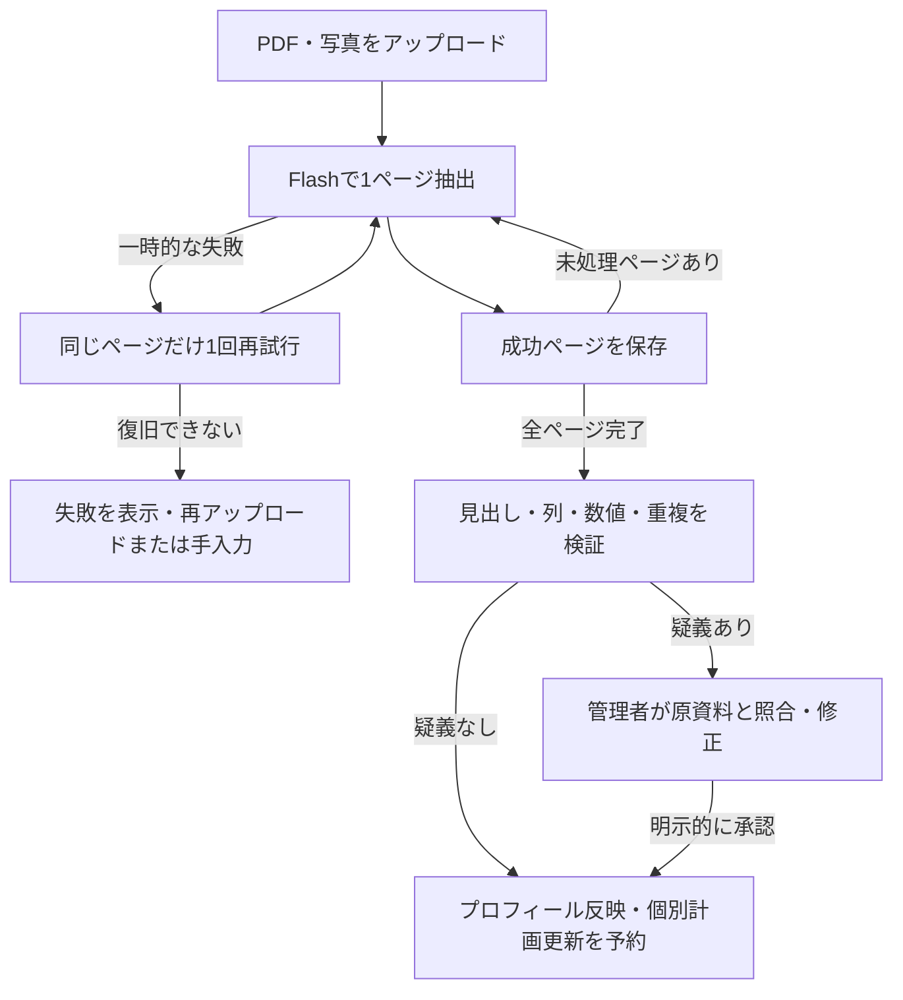

# 模試解析：検証・復旧の改善とモデル採用判断

2026-09-21。**模試解析はGemini 2.5 Flashを採用し、上位の2.5 Proへの変更は見送った。** 上位モデルを実測したうえでの限定的な判断であり、モデル全般の優劣やFlashの最適性を証明したものではない。

この記録が現在の実装・判断。[初回比較](exam-model-benchmark-results.md)と[構造化抽出v2](exam-model-benchmark-improvement.md)は当時の記録として残す。発表用の短い説明・根拠の一覧は [presentation-evidence.md](presentation-evidence.md)。

## 実装した利用者の動き

1. 管理者が生徒登録・編集で模試PDF／写真を選ぶ。送信後は画面を離れても解析を続ける。
2. AIがページ単位で数値と表・列の見出しを抽出する。コードが列の区分、数値の整合性、重複を検査し、得点率・平均との差を計算する。
3. 検査を通れば、手入力の変更を保持して初期プロフィールへ反映し、既存の個別学習計画更新を予約する。
4. 疑義があれば「確認が必要」で保留する。アップロードした管理者が元資料を拡大して読み取り候補と照合し、必要な箇所を編集して承認する。承認前はプロフィール・計画へ反映しない。
5. 原画像は通常の完了・失敗時に削除。確認待ちの場合だけ照合用に保持し、承認時に削除する。元の抽出、修正前の提案、承認者・時刻は結果の監査情報として残す。



図の再試行はページごとに最大1回。予算上限・安全性遮断は再試行しない。対話用の時間制限は変更せず、模試専用経路だけ1試行60秒・1呼び出し全体65秒とした。内部のJSON修復や別モデルへの切替を重ねず、失敗したページの再試行は永続ジョブに任せる。成功したページを保存してから次へ進むため、保存済みページの読み直しを避けられる。API成功後、チェックポイントをDBへ保存する前にプロセスが落ちる場合まで、厳密に課金が一度だけとなる保証はしていない。

既存のワーカー定期実行は10秒間隔・有効であることをDBから確認した。次ページ・最終処理は即時起動も試み、遅延再試行は定期実行が拾う。本番環境では対応するワーカーURL・秘密値・定期実行設定が必要。

## 保存済みの失敗を使った修正確認

v2のB_scan・Flash回答を再利用し、追加API費用なしで比較した。

| 項目 | 修正前 | 修正後 |
| --- | ---: | ---: |
| 正しい値を持つ完全な成績行を保持 | 6行 | 10行 |
| 同じ数値なのに競合と判定 | 4件 | 0件 |

行全体が一致するかではなく、同じ項目のセルを照合する。同じ値は統合、nullは既知の値で補完、非nullの異なる値は保留する。統合して初めて得点が満点を超えるケースも検査する。これは重複処理の回帰検証であり、v2には元見出しの情報がないため、v2回答をそのまま新経路で自動反映可能としたわけではない。

## 上位モデルとの少数比較

問題のあったA_scanとB_scanを事前に選び、Flashと2.5 Proを比較した。元の正解表、画像変換、要求プロンプト、JSONスキーマ、出力上限10,000トークン、1回60秒を揃えた。OrcaReplayのrecord/compareでモデル名のみ切り替える。画像は実物2回分の模試の各1ページ。同じ資料への改善試験なので、未知の模試に対する独立評価ではない。

| 資料 | Flash | Pro | Flash待ち時間・費用 | Pro待ち時間・費用 |
| --- | ---: | ---: | --- | --- |
| A スキャン | 57/57 | 57/57 | 28.56秒・$0.016112 | 54.80秒・$0.110792 |
| B スキャン | 30/30 | 0/30（応答なし） | 15.98秒・$0.009134 | 60.02秒でタイムアウト・費用不明 |

初回の対象項目取得はFlash 87/87、Pro 57/87。BのProは数値を誤読したという意味ではなく、時間内に利用可能な回答を得られなかった。Proを長時間待った場合や別設定での能力は未評価。

同じAの一致結果を得るための確認費用はProがFlashの約6.9倍、時間は約1.9倍だった。**今回の条件では、Proへの変更による品質上の利点が確認できず、費用と時間は増えた**ため、Flashを維持する。Pro一般が不向きだとは結論しない。APIのモデル一覧でも提供状況と価格を確認し、結果とともにローカル保存した。

### 設問別成績の追加確認

本体へ組み込む設問別得点・全国平均点の経路を確かめるため、C_scanだけFlashを追加で1回呼んだ。これは上のPro比較に含めない。

- 数値の取得：63/63一致、19.08秒、$0.010850。
- 見出し情報：科目名だけを表見出しとして返し、設問別成績の親見出しは得られなかった。
- 動作：表区分を確認できないため、正しい数値が得られていても自動反映を保留。管理者向けの確認候補に全数値を残す。

今回Flashの3入力の採点対象数値は150/150一致したが、自動反映可能と判定したのはA/Bの2入力、Cの1入力は人の確認が必要だった。**「150項目を読めた」と「3入力を無確認で自動処理できた」は別。** 初回9条件・450項目の成績を、この3スキャン条件で置き換えない。

## 検証処理の範囲と限界

- 表見出しだけでなく「換算得点」などの列見出しも参照する。科目の複数行表記は、文字列を保ったまま統合する。
- 科目別平均点など、今回の計画の根拠にしない余分な列は使用しない。元の抽出は監査用に残す。
- 私大評価用など、見出しから対象外と分かる表を除外する。全国偏差値には全国・偏差値の見出し、単元平均点には全国平均点の見出しを求める。
- 不明確な値、矛盾、必要な見出しの不足は承認待ちにする。正しい行が一部あっても、疑義を残したまま分析全体を自動反映しない。
- 見出し自体もAIが抽出したもので、別OCRによる独立照合ではない。モデルがもっともらしい誤った見出しを作った場合の完全検出は保証できない。
- 実物に出会って分かった表記の違いに対し、モデル呼び出し後に検証ルールを調整し、保存済み回答で再評価した。改善後の確認負担は同じ少数資料に対する結果で、汎化性能の測定ではない。モデルへの要求本文・スキーマは途中変更していない。
- 初期目標・20〜30分の学習時間は変更可能なルールによる提案。教育的妥当性や学習効果の実証ではない。個別計画は既存の後続AIジョブが授業記録・対話履歴等と合わせて作成する。

模試専用の`exam`経路は未検証モデルへ自動的に切り替えない。別プロバイダー障害対策を完全に実装・実測した、とは説明しない。復旧できない時は失敗を明示し、手入力・再アップロードへ進める。既存の対話・授業資料・音声のモデル経路は別であり、今回の数値をそれらの品質根拠に流用しない。

## 費用台帳

| 区分 | API呼び出し | 確認できた費用 | 費用不明 |
| --- | ---: | ---: | ---: |
| 初回比較と再現性確認 | 40回 | $0.201082 | 1回 |
| v2構造化抽出 | 21回 | $0.122786 | 3回 |
| 今回v3（上位比較4回＋C補足1回） | 5回 | $0.146888 | 1回 |
| 累計 | **66回** | **$0.470756** | **5回** |

不明5回に各$0.25を留保した予算管理額は**$1.720756／承認上限$2**。実際の請求額ではない。タイムアウト・HTTP 400を無料と推定せず、最終請求額はOrcaRouter側の照合が必要。全比較は実験用アカウントを使い、チームメイトの本体キーで追加ベンチマークを行っていない。この記録で追加有料実験は終了した。

## 実装・検証の追跡先

| 内容 | ファイル |
| --- | --- |
| 抽出項目・見出し検証・セル統合・提案 | `src/lib/materials/exam-extraction.ts` |
| ページ保存・有限回の再試行・承認待ち | `src/lib/jobs/exam-handler.ts` |
| 模試専用モデル・60秒期限 | `src/lib/orcarouter/selection.ts`, `call.ts` |
| 承認・修正・権限確認 | `src/app/api/admin/exam-analyses/[id]/route.ts` |
| 原資料との比較画面 | `src/components/admin/exam-review.tsx` |
| 承認待ちを自動反映させない状態 | `supabase/migrations/0051_exam_review.sql`（設定済みDBへ適用済み） |
| 数値・表区分・重複の回帰試験 | `tests/features/exam-verification.test.ts` |
| 再開・上限・承認前の未反映 | `tests/features/exam-worker.test.ts`, `exam-review.test.ts`, `exam-analysis.db.test.ts` |
| 架空データによる実ブラウザ・DB反映試験 | `scripts/benchmarks/check-exam-review-ui.mts` |

ブラウザ試験では、デスクトップ表示、390px幅での横はみ出しなし、承認チェック前のボタン無効、承認前のプロフィール未変更、編集した結果の反映、承認後の原画像削除、保存済み反映の再試行、分析状況一覧を確認した。試験用の所属・ユーザー・資料は終了時に削除し、AIは呼び出していない。

最終検証：`npm test` は35ファイル・260件すべて成功（実DB試験を含む）。`npm run build -- --webpack` は型検査・本番ビルドとも成功。変更したTypeScriptのESLint検査、`git diff --check` も通過した。

公開資料に利用できる画面例は [デスクトップ](assets/exam-review/desktop.png)・[モバイル](assets/exam-review/mobile.png)。どちらも架空の数値だけを使ったUI検証画面で、ベンチマークの原資料ではない。

原資料・回答全文・詳細採点はGit対象外の`benchmark-data/exams/`に保存する。

- `runs-evidence-v3/protocol.json`: A/Bの事前条件と要求ハッシュ
- `runs-evidence-v3/supplemental-protocol.json`: Cの補足試験条件
- `runs-evidence-v3/extraction-source.ts`: 呼び出し前の抽出・検証ソース
- `runs-evidence-v3/final-verifier-source.ts`, `final-verification-policy.json`: オフライン調整後の検証ソースと留意事項
- `runs-evidence-v3/responses/`: 5回の回答・タイムアウト・費用
- `runs-evidence-v3/scores.json`, `field-scores.csv`: 取得精度と自動反映判定を分けた採点
- `runs-evidence-v3/offline-duplicate-regression.json`: 重複処理の改善結果
- `runs-evidence-v3/ui-check.json`: 実ブラウザ試験結果
- `work-evidence-v3/.orca/runs/`: OrcaReplayの比較記録
- `runs/ledger.json`: 全実験共通の予算台帳

再集計はAPIを呼ばない。

```sh
node --import tsx scripts/benchmarks/score-exam-evidence.mts
```
