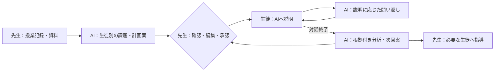

# 授業のあとをAIに任せる。生徒がAIへ説明する学習エージェント「トイノワ」

「わかった？」と聞くと、「わかりました」と返ってくる。でも、自分の言葉で説明してもらうと、理解の違いや疑問が見えてくることがあります。

一人ずつ説明を聞き、復習課題を考え、次の授業につなげたい。それをすべて先生が続けるには時間がかかります。

そこで、**先生が授業記録を渡すと、AIが個別の復習課題を準備し、生徒との説明対話を分析して、次回の課題案まで作る「トイノワ」**を開発しました。

[AI HACK 2026](https://aihackathon.jp/)のテーマは「業務を自律化するAIエージェント」。私たちは、授業後の課題設計・聞き取り・分析・次回準備を一つの仕事として任せることを目指しました。AIの呼び出しとモデルの使い分けには[OrcaRouter](https://www.orcarouter.ai/ja)、比較実験にはOrcaReplayを使っています。

- サービス：[トイノワ](https://toinowa.vercel.app/)
- ソース：[GitHub](https://github.com/Ryuto42/ai_hackathon)
- 測定条件・検証記録：[根拠集](https://github.com/Ryuto42/ai_hackathon/blob/main/docs/evidence.md)

> 以下の操作結果は2026年9月22日のローカル版で確認したものです。公開版の動作確認とは区別しています。画面の生徒と対話はテスト用です。

## 先生は教える。AIは授業後の個別対応を準備する

対象は塾・個別指導の先生と生徒です。クラス単位でも、生徒一人を指定しても使えます。

| 役割 | 担当すること |
|---|---|
| 先生 | 授業をする。記録や資料を渡す。AI案を確認・必要なら編集して配信する |
| 生徒 | AIに自分の言葉で説明し、問い返しに答える |
| AI | 授業・模試・履歴から課題を準備し、対話を分析して次回案を作る |
| 管理者 | 所属・利用者の管理、模試情報の確認、AIの用途と費用を管理する |

学習体験は、相手に説明して自分の理解を確かめるファインマンテクニックに着想を得ています。AIは長い解説をする先生役ではなく、生徒の説明を聞く相手です。

説明が止まる理由は理解不足だけとは限りません。文字と音声を用意し、入力速度だけで点数を下げず、先生には説明の根拠を返します。教育効果は今後検証すべきもので、このサービスで成績向上を実証したという意味ではありません。

## 一つの授業で、最後まで動かしてみる

### 1. 授業記録を渡す

テストでは、次の授業メモを使いました。

> 一次関数の傾きと切片を復習した。傾きはxが1増えたときのyの増加量、切片はx=0のときのyの値。y=2x+3とy=-x+4を扱った。生徒は傾きと切片を時々取り違える。文章題や連立方程式はまだ扱っていない。

先生は対象生徒と期限を選び、メモを渡します。PDFや写真も入口として用意していますが、この一周ではメモを使いました。

AIは授業範囲を中心に、模試・過去の説明・評価を使って難易度や問い方を調整します。準備を受け付けた後はバックグラウンドで進めます。

### 2. 先生が確認して配信する

できたお題は、二つの一次関数の式から傾きと切片、それに対応するグラフの特徴を説明するものでした。先生は内容と選定理由を読み、編集するか、そのまま配信するか判断します。

承認前には生徒の一覧へ表示されず、直接URLからも開けませんでした。先生が配信した後に取り組めることを、別ロールのブラウザで確認しています。

### 3. 生徒が説明し、言い直す

最初は意図的に「傾きはx=0のときのyの値」と逆に説明しました。AIが区別を問い返し、次に「xが0から1へ増えると、yは3から5へ増えるので傾きは2」と説明し直しました。

このテストでは5往復で終了し、会話全体を使った評価に、最初の取り違えから修正した経過が残りました。最後の一言だけで採点する仕組みにはしていません。

生徒には終了後に簡易フィードバックを表示します。先生向けの詳細評価や点数は返しません。今回は観測が少なく評価が確認待ちとなったため、AIの具体的な助言もそのまま見せず、一般的な振り返りを表示しました。

### 4. 次の準備まで進み、配信は先生に戻る

対話の完了後、評価を根拠にした次回案が生成されました。課題は下書きで止まり、先生が期限と内容を確認して配信するまで、生徒には届きません。

**「AIに問いを出させる」だけでなく、説明の観測を先生の次の宿題判断へ戻すところまでをつないだ**のが、トイノワで重視した点です。

## 自律化と、人の判断の境界

| AIが判断すること | コードが制御すること | 人が判断すること |
|---|---|---|
| 生徒に合う課題とその理由 | 権限・保存・生徒別ジョブ | 配信する内容・対象・期限 |
| 説明の次に確かめたい点 | 対話回数の上限、終了後だけの評価公開 | 生徒自身の説明 |
| 会話の根拠付き分析、次回案 | 修正済み評価の引き継ぎ | 先生による評価修正・声かけ |
| 模試の見出しと数値の読み取り | 整合性検査と確認待ち | 疑義のある資料の照合 |

実行の流れや権限はコードで定義しています。AIが任意の外部ツールを自由に選ぶ構成ではありません。その枠内で、生徒に合わせた課題・問い返し・分析の内容を判断します。

先生が関わるのは、毎回ゼロから問題文を設計する工程ではなく、教育上の判断が必要な箇所です。ただし、先生の負担が何%減るかはまだ実測していません。

## コストパフォーマンス：高いモデルへ替える前に、何を間違えたか調べた

模試の読み違いは、その後の課題設計にも影響します。そこで実物の模試2回分・紙3ページを、スキャンと2条件の写真にして9入力を用意しました。同じ紙を撮り直しているため、9種類の独立した模試ではありません。

原本と照合・承認した正解表で、必要な数値450項目／モデルを採点しました。数字が合っていても、違う科目や別の意味の列に対応していれば正解にしません。

OrcaReplayで入力を揃えて実行し、成功ステータスとは別に、必要項目の一致、時間、応答で確認できる費用を集計しました。

| 初回9入力の比較 | 必要項目の一致 | 平均時間 | 9回の確認費用 |
|---|---:|---:|---:|
| Gemini 2.5 Flash | 399/450（88.7%） | 20.53秒 | $0.097298 |
| Gemini 2.5 Flash-Lite | 325/450（72.2%） | 12.23秒 | $0.005744 |
| GPT-4o mini | 31/450（6.9%） | 3.63秒 | $0.039648 |

これはモデル一般のOCR能力の順位ではなく、今回の資料・要求・前処理・出力上限を含む処理の結果です。4o miniでは必要項目が358件欠落した一方、JSON検証は全件通っていました。**形式が正しいだけでは、学習計画へ使えるとは言えません。**

次に、読み取りと学習提案を分け、表の見出し・列の意味を抽出し、数値と重複をコードで検査しました。その後、問題のあったA/BのスキャンをFlashとProで各1回ずつ比較しました。

| 追加比較 | Flash | Pro |
|---|---|---|
| A：57項目 | 57/57、28.56秒、$0.016112 | 57/57、54.80秒、$0.110792 |
| B：30項目 | 30/30、15.98秒、$0.009134 | 60秒でタイムアウト、費用不明 |

この条件では上位モデルへ替える利点を確認できず、模試はFlashを維持しました。別帳票や長い待ち時間でのProの能力まで否定する結果ではありません。

補足で確認したCスキャンはFlashで63/63項目が一致しましたが、表の親見出しを確認できず、人の確認へ回しました。**数値が一致したことと、確認なしで使ってよいことを分けました。**

同じ少数資料で調整した結果なので、「精度100%になった」とは主張しません。初回9入力を追加3スキャンの結果で置き換えず、失敗・保留・費用不明も残しています。

- [比較の条件・正解表の方針](https://github.com/Ryuto42/ai_hackathon/blob/main/docs/exam-model-benchmark.md)
- [Flash継続の判断と復旧設計](https://github.com/Ryuto42/ai_hackathon/blob/main/docs/exam-reading-reliability.md)
- [公開可能な集計JSON](https://github.com/Ryuto42/ai_hackathon/blob/main/docs/data/exam-benchmark-summary.json)

### 一周の仕事に、いくらかかったか

先ほどの一周では、計画2回・対話5回・相談の意味判定5回・本人性の補助分析1回・最終評価1回の計14件でした。ログ上の費用は合計 **$0.007040**。最終評価はFlash、それ以外はFlash-Liteと記録されていました。

1例の記録値であり、全生徒の平均や請求額の保証ではありません。それでも、モデルの単価だけでなく、**一つの業務を最後まで進める費用**を観測できるようにしています。

資料の抽出結果の共用、保存済みページや計画の再利用、会話終了後の本評価によって、不要な再生成も減らしています。管理者は誰がどの機能でどのモデルを使ったかを確認できます。模試の費用台帳では、金額不明の呼び出しを0ドル扱いせず留保額を計上しました。

## 安全性：相談を、学習の妨げとして扱わない

安全性では、所属・担当範囲の権限確認に加え、教材・履歴を命令から区別する境界、入力の検査・個人情報のマスク、出力の検査を組み合わせています。管理権限でDBを操作する経路はRLSを迂回するため、アプリ側でも権限を確かめます。

開発中のテストでは、つらさを相談した生徒に、AIが学習を続けるよう問い返す問題がありました。単語の一致だけでなく、文脈の意味判定を加え、相談時は学習の問い返し・採点・自動終了から分けました。先生向けには確認対象を残し、生徒へ「先生に確実に伝わった」とは約束しません。

さらに、相談や学習再開として判定・記録した発言を、次回の学習計画を作る参照からも除外しました。生徒が説明していないことを、理解度の根拠へ混ぜないためです。

画像内の命令への対策も検証対象です。試験は現在の模試用要求とスキーマを共用し、正常な成績転記、数値の改変、遮断、判定不能を分けています。ただし、**この条件での実モデル防御率はまだ測定していません**。固定応答のテスト成功を、未知の攻撃を防げる証拠としては扱いません。

## 信頼性：途中で失敗しても、保存できたところから戻す

AIの出力が使えない場合、成功したように見せないことを重視しました。

- 模試はページ単位で保存し、失敗ページを限定して再試行する。疑義のある結果は確認待ちにする。
- 通常のモデル呼び出しには時間制限・代替経路・縮退を設ける。模試専用処理では未検証の安いモデルへ黙って切り替えない。
- 評価保存後に完了処理が失敗しても、保存済み評価から復習予約と次回案の準備を再開する。
- チャットの通信断では、保存状況を確認してから未保存の入力を戻す。勝手に重ねて送らない。
- 件数取得に失敗したときに「0件」「全部完了」と表示しない。

今回の一周でも、評価ジョブは再試行後に保存済み評価を使って成功し、本評価のモデル呼び出しは1件でした。初回に失敗した原因は、この記録だけからは断定していません。

変更後の自動テストは **46ファイル・328件成功**、本番ビルドも成功しました。自動テストのAI応答は固定し、DB試験では一時データを使っています。実モデルで一周した確認、通信失敗を模したブラウザ確認、コードの回帰試験は、それぞれ別の証拠として残しています。

## 構成と、これから確かめること

画面・APIはNext.js 16／React 19／TypeScript、認証・保存はSupabase Auth／PostgreSQL。課題生成・評価はDBのジョブキューとワーカーで進め、OrcaRouter経由で用途に応じたモデルを呼び出します。

次に確かめたいのは、実際の先生が課題案を確認するときの負担です。同じ授業で従来の準備と比べて、所要時間、修正した箇所、その理由を測りたいと考えています。未見の模試帳票、音声の環境差、相談検知の誤検知・見逃しも検証を続ける必要があります。

現状のAI案は、理由が長かったり、次回の問いが前回に似たりすることもあります。観測が少ない評価は確認待ちになりやすく、生徒への振り返りも一般的になります。また、会話の完了更新と評価ジョブ投入の間の障害など、復旧を補強すべき境界も残っています。

トイノワでは、授業で教えた内容を、生徒自身の説明と次の復習へつなぐ仕事をAIに任せます。先生が一人ずつの理解に向き合うために、その前後の準備をAIが担うサービスを目指しています。
